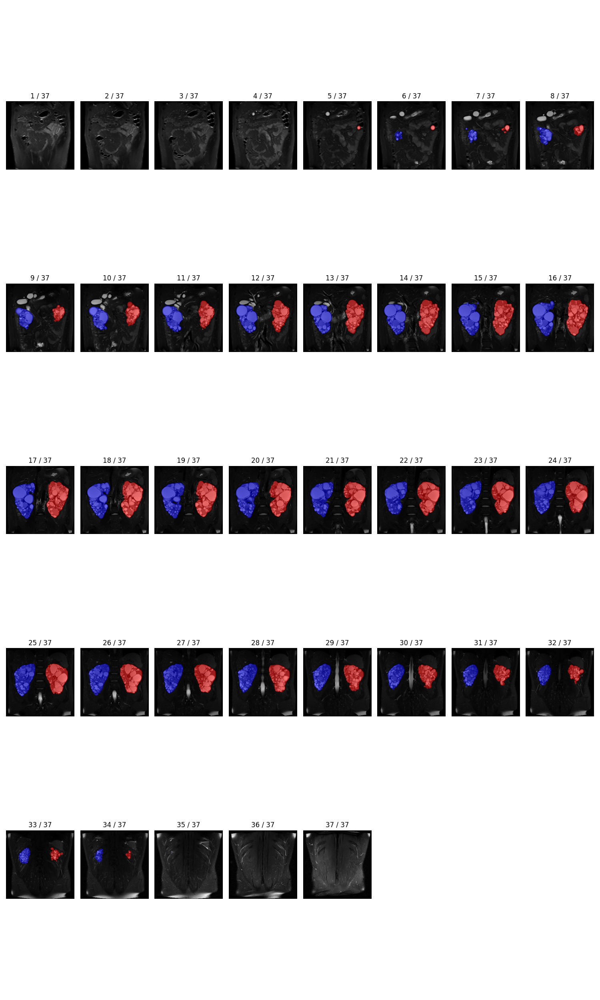
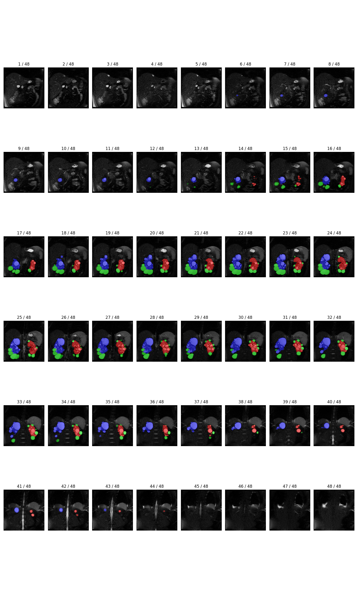

# ExoCystSegNet

This software package (ExoCystSegNet) includes the source codes for a fully automated segmentation of kidneys and exophytic cysts in patients with autosomal dominant polycystic kidney disease (ADPKD). The [nnU-Net](https://www.nature.com/articles/s41592-020-01008-z#citeas) was utilized to train the neural networks, and this package is for testing the pretrained neural networks to automatically segment right kidney, left kidney, and exophytic cysts. You can refer to the following paper if you would like to know what the [exophytic cysts](https://jasn.asnjournals.org/content/31/7/1640) are:

    Bae, K. T., Shi, T., Tao, C., et al. (2020). Expanded Imaging Classification of Autosomal Dominant 
    Polycystic Kidney Disease. Journal of the American Society of Nephrology, 31(7), 1640-1651.

ExoCystSegNet was trained and tested using *T2*-weighted MR images. The paper illustrating training procedure and details of training and testing datasets will be published in *Journal of the American Society of Nephrology (JASN)*. For more information, please read the [following paper](https://doi.org/10.1681/ASN.2021111400):

    Kim, Y., Tao, C., Kim, H., Oh, G. Y., Ko, J., Bae, K. T. (2022). A Deep Learning Approach for Automated Segmentation 
    of Kidneys and Exophytic Cysts in Individuals with Autosomal Dominant Polycystic Kidney Disease. 
    Journal of the American Society of Nephrology, 33(8).

# Installation
## Dependencies
ExoCystSegNet can be installed and run on Linux, Windows, and macOS. Following are the list of operating systems on which ExoCystSegNet was tested. 
* Linux
	* Ubuntu 16.04 LTS (GPU, CPU)
	* Ubuntu 20.04 LTS (GPU, CPU)
* Windows
	* Windows 10 (GPU, CPU)
	* Windows 11 (CPU)
* macOS
	* macOS Monterey 12.3.1 (CPU only)

Note that PyTorch with GPU (a few seconds/case) performs much faster than PyTorch with CPU (~10 minutes/case). **To use GPU version of PyTorch, it is important to install PyTorch with <U>*an appropriate CUDA version*</U> for your workstation!** Otherwise, you need to install PyTorch with CPU only version. We recommend to use virtual environment (e.g., [Anaconda](https://anaconda.org)).

ExoCystSegNet was tested on PyTorch versions from 1.7 to 1.11 (latest version as of Apr 25, 2022).
## PyTorch (GPU)
You can skip this step if you already have PyTorch with CUDA available (version >= 1.7).

    >> conda create -n [virtual_env_name] python=3.8.5
    >> conda activate [virtual_env_name]
    >> conda install pytorch==1.8.0 torchvision==0.9.0 torchaudio==0.8.0 cudatoolkit=[your_CUDA_version] -c pytorch -c conda-forge
## PyTorch (CPU)
You can skip this step if you already have PyTorch with CPU (version >= 1.7).

    >> conda create -n [virtual_env_name] python=3.8.5
    >> conda activate [virtual_env_name]
    >> conda install pytorch torchvision torchaudio cpuonly -c pytorch
## Download ExoCystSegNet & Install nnU-Net
    >> git clone https://github.com/ywkim0909/Exophytic-Cyst-Segmentation
    >> cd Exophytic-Cyst-Segmentation
    >> pip install -e nnUNet_install

# Usage
ExoCystSegNet consists of 2 main modules: 1) automated segmentation of kidneys and exophytic cysts generating region mask files (NIfTI format) and 2) Plotting label overlayed images on MR images.

## 1) Segmentation and generation of region label files
This module uses pretrained weights stored in [pretrained_model](https://github.com/ywkim0909/Exophytic-Cyst-Segmentation/tree/master/pretrained_model) and loads test images in the [images_test](https://github.com/ywkim0909/Exophytic-Cyst-Segmentation/tree/master/images_test) folder. In the [images_test](https://github.com/ywkim0909/Exophytic-Cyst-Segmentation/tree/master/images_test) folder, there are 3 cases with exophytic cysts and 3 cases without exophytic cysts.

    >> python auto_eexo_seg_main.py -i [input_folder(option)] -o [output_folder(option)]

The `input_folder` and `output_folder` are set to [images_test](https://github.com/ywkim0909/Exophytic-Cyst-Segmentation/tree/master/images_test) and [eexo_seg_results_raw](https://github.com/ywkim0909/Exophytic-Cyst-Segmentation/tree/master/eexo_seg_results_raw) as a default, respectively. Specifying input and output folders is optional, so you can just put `auto_eexo_seg_main.py` if you want to test the default files.

## 2) Plotting label overlayed images
Plotting label overlayed images module loads the original MR images and label files and generate multiple images (slice-by-slice) overlayed in different colors with the corresponding kidneys and exophytic cysts masks (**blue**: right kidney, **red**: left kidney, **green**: exophytic cyst). The images are saved in [eexo_seg_mask_overlay](https://github.com/ywkim0909/Exophytic-Cyst-Segmentation/tree/master/eexo_seg_mask_overlay) folder.

    >> python plot_maskoverlay_images_main.py -i [input_folder(option)] -l [label_folder(option)] -o [output_folder(option)]

Specifying input, label and output folders is also optional, so you can just put `plot_maskoverlay_images_main.py` if you want to plot the images with the default files. The examples of saved images are illustrated below:

### (Example 1) Label overlayed images (case without exophytic cysts)

### (Example 2) Label overlayed images (case with exophytic cysts)

